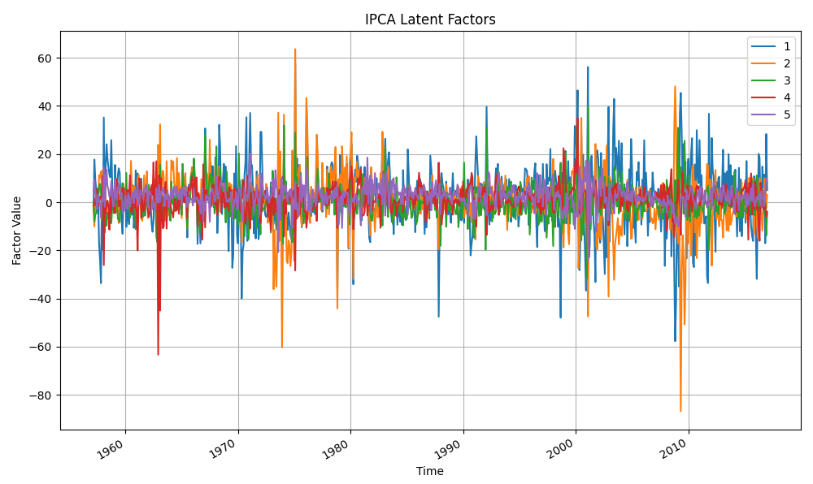
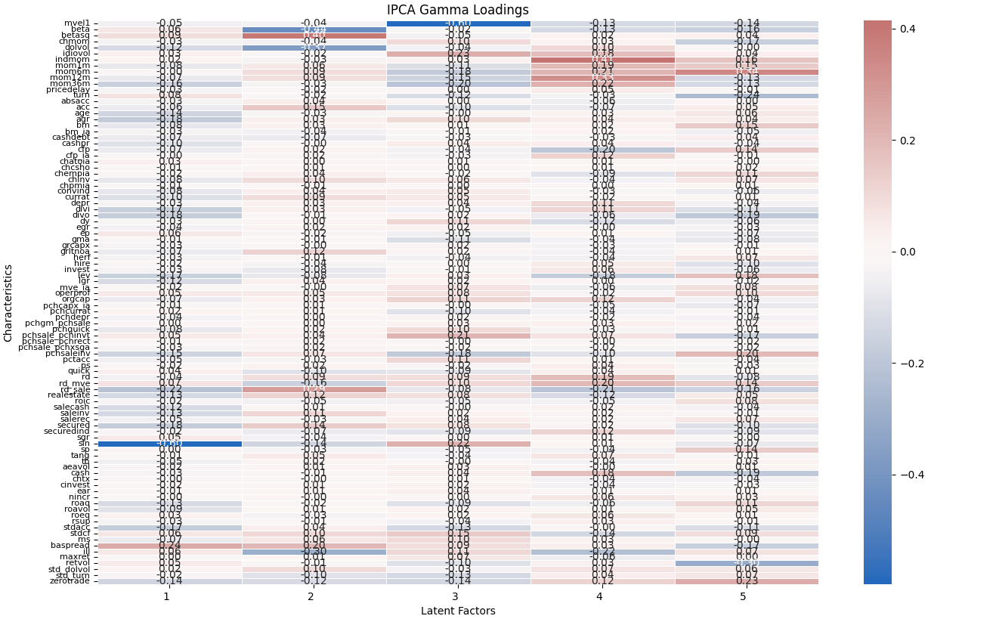

# IPCA-asset-pricing
Instrumented Principal Component Analysis (IPCA) application to asset pricing based on Kelly, Pruitt and Su (2019 and 2020). 

## Installation & Usage
1. **Download dataset**
    - The implementation features a choice among different datasets. Raw data must be downloaded to or provided under `data/{dataset}/`.
        - **fnw**: Freyberger, Neuhierl and Weber (2017), as used by Kelly, Pruitt and Su (2019)
        [Data Source](https://sethpruitt.net/research/)
        - **oap**: Open Asset Pricing by Chen and Zimmermann (2021)
        [Data Source](https://www.openassetpricing.com)
        - **gkx**: Gu, Kelly and Xiu (2020), based on Green, Hand and Zhang (2016)
        [Data Source](https://dachxiu.chicagobooth.edu)
2. **Install requirements** from requirements.txt
    ``` 
    pip install -r /path/to/requirements.txt
    ```
3. **Run run_ipca.py** to
    - downloads return data (caveat: requires WRDS credentials)
    - performs data preprocessing
    - generates IPCA instances from IPCA.py (caveat: takes time until ALS convergence)
    ``` 
    python run_ipca.py
    ```
4. **Test IPCA results** (example usage)
    ``` python
    print(IPCAs[0].r2)
    print(IPCAs[0].Gamma)
    print(IPCAs[0].Fac)
    IPCAs[0].visualize_factors()
    IPCAs[0].visualize_gamma()
    ```
5. **Data** at every step (raw data, preprocessed data and result data) is stored under `data/{dataset}/` as pickle-objects and can be loaded for later use.
    ``` python
    with open('result_data.pkl', 'rb') as inp:
        IPCAs = pickle.load(inp)
    ```

(c) Jonas Knappitsch at Vienna University of Economics and Business (2025)

## Sample Results
``` python
IPCAs[4].visualize_factors()
```


``` python
IPCAs[4].visualize_gamma()
```
