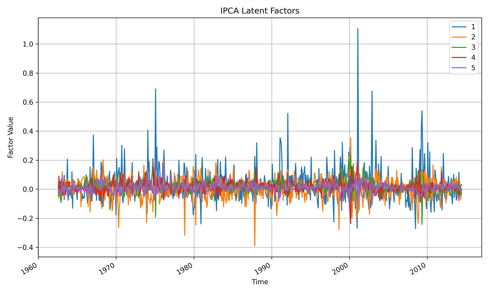
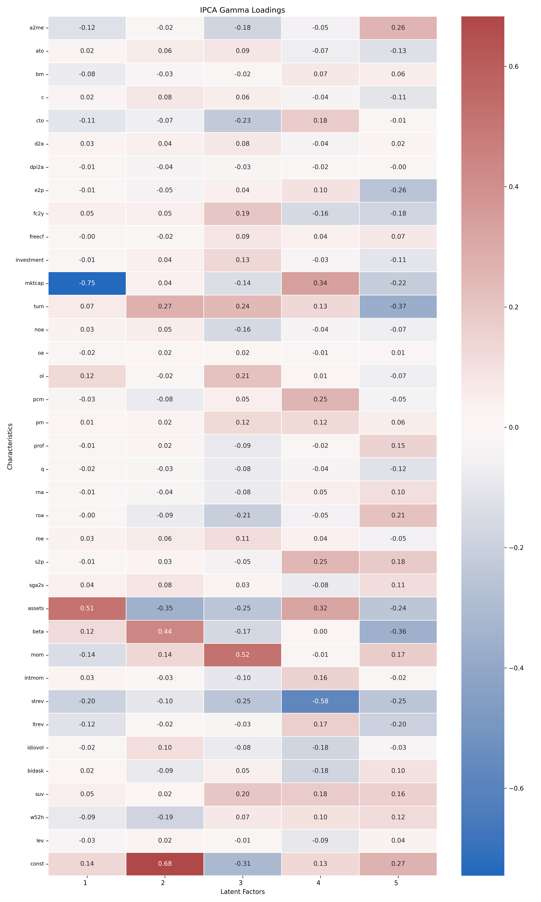
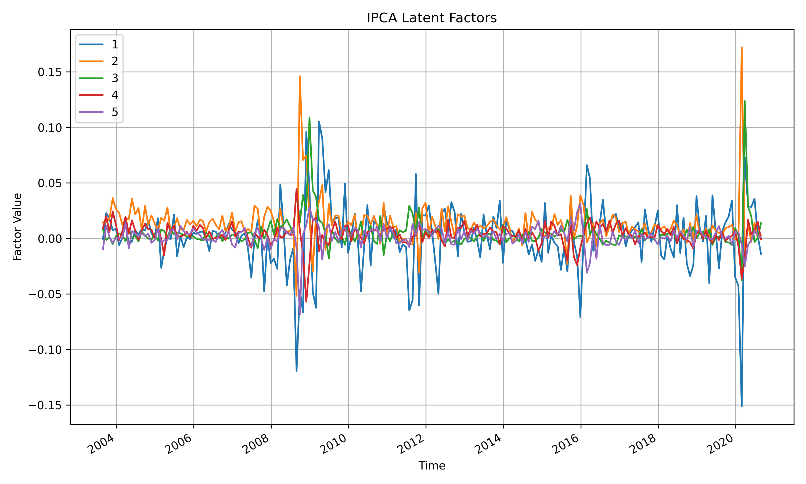
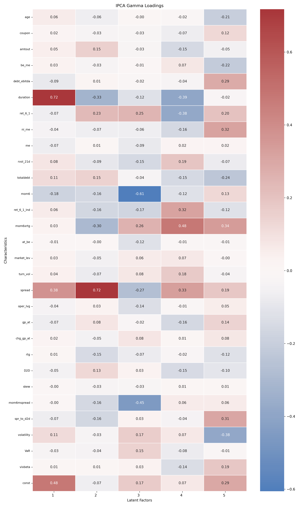
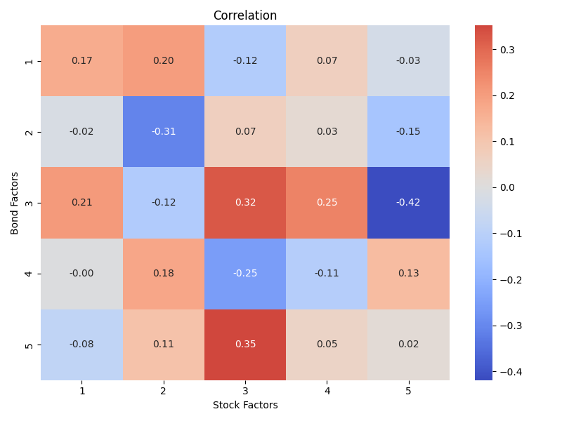

# IPCA-asset-pricing
Instrumented Principal Component Analysis (IPCA) application to asset pricing based on Kelly, Pruitt and Su (2017 and 2019) to model stock and bond returns.

## Usage
1. **Install requirements** from requirements.txt
    ``` 
    pip install -r requirements.txt
    ```
2. **Run `main.py`** 
    - At startup, the script requires a WRDS login. 
    - The script attempts to download the required datasets automatically from their sources. In case if issues, download manually and provide under `data/{dataset}/`.
        - **fnw**: Freyberger, Neuhierl and Weber "Dissecting Characteristics Nonparametrically" (2017), as used by Kelly, Pruitt and Su (2019) "Characteristics are Covariances"
        [Data Source](https://sethpruitt.net/2019/12/01/characteristics-are-covariances/)
        - **kpbonds**: Kelly and Pruitt (2022) "Reconciling TRACE bond returns" [Data Source](https://sethpruitt.net/2022/03/29/reconciling-trace-bond-returns/)
    - The execution then proceeds in the following order:
        - IPCA Application to Stocks
        - IPCA Application to Bonds
        - Common Factor Structure
    - The script can be executed fully at once or step by step.
    ``` python
    python main.py
    ```
3. **Test IPCA model results** (example usage)
    - Once an IPCA model has been estimated, it can be analyzed as described below.
    ``` python
    model.r2 # R2 on Asset (Rr2) and Managed-Portfolio Level (Rx2)

    model.Gamma # Loadings

    model.Fac # Factor Returns

    model.visualize_factors() # Loadings Visualized

    model.visualize_gamma_heatmap() # Factor Returns Visualized

    model_bonds.Fac.T.mean() # Factor Expected Returns (monthly)

    (model_bonds.Fac.T.mean()/model_bonds.Fac.T.std()) * (12**0.5) # Factor Sharpe Ratios (annualized)
    ```

(c) Jonas Knappitsch at Vienna University of Economics and Business (2025)

## Results
The results as covered by the underlying Thesis are provided under `results/` and illustrated in the following.

### IPCA Results for Stocks
``` python
model_stocks.visualize_factors()
```


``` python
model_stocks.visualize_gamma_heatmap()
```


### IPCA Results for Bonds
``` python
model_bonds.visualize_factors()
```


``` python
model_bonds.visualize_gamma_heatmap()
```


### Common Factor Structure
